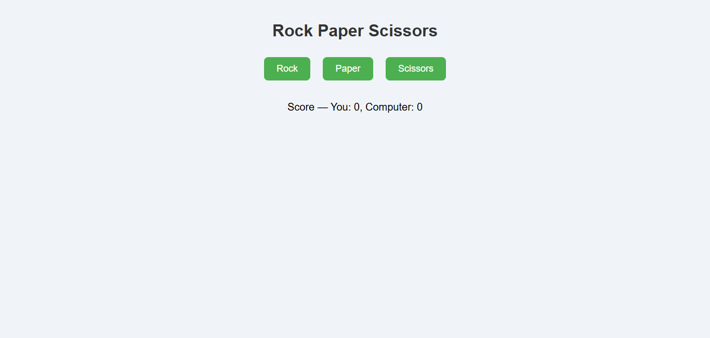

# 🪨 📄 ✂️ Rock Paper Scissors Game

A simple and fun Rock Paper Scissors game built with HTML, CSS, and JavaScript. Play against the computer and try to reach 5 points first to win the game!

## 🎮 Demo



## 🚀 Features

- Interactive buttons for Rock, Paper, and Scissors
- Random computer opponent
- Score tracking
- Game ends when either player reaches 5 points
- Responsive and clean UI

## 🛠️ Technologies Used

- HTML
- CSS
- JavaScript (Vanilla)

## 🧠 Game Logic

- Player clicks a button to choose Rock, Paper, or Scissors
- Computer randomly selects a choice
- The winner of the round is determined by the standard rules:
  - Rock beats Scissors
  - Paper beats Rock
  - Scissors beats Paper
- First to 5 points wins the game

## 📦 How to Run Locally

1. Clone the repository:

```bash
git clone https://github.com/FrontEndExplorer-Temp/rock_paper_scissors.git

2. Open the folder:

cd rock-paper-scissors

3. Open index.html in your browser.
